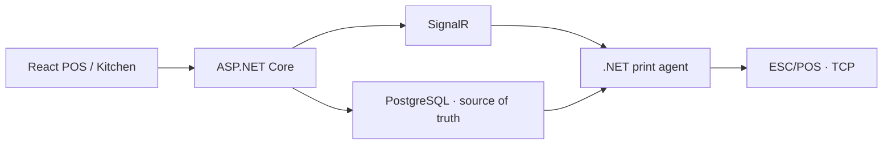
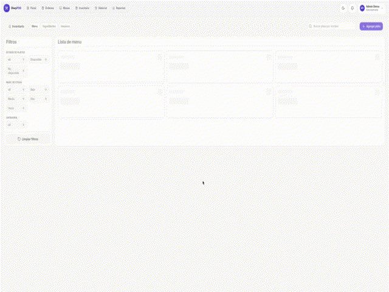

# DiwyPOS — Restaurant Point of Sale

### Multi-tenant ordering, inventory, payments, kitchen workflows, and resilient ESC/POS printing

[](https://dotnet.microsoft.com/) [](https://dotnet.microsoft.com/apps/aspnet/signalr) [](https://react.dev/) [](#verified-evidence)
[](https://github.com/Johan-Alvarez-Dev/diwypos-case-study/actions/workflows/ci.yml)

DiwyPOS coordinates tables, orders, kitchen status, payments, inventory, and reporting. A persistent print queue and local .NET agent deliver ESC/POS tickets even when real-time notifications are interrupted.

> Restaurant data, printer addresses, tenant configuration, and production source remain private. Public samples are independently written.

[Open the live demo](https://diwy-pos-web.vercel.app/) · [Product tour](./docs/product-tour.md) · [Architecture](./docs/architecture.md) · [Code samples](./sample-code) · [Video](#video-walkthrough)

<picture>
  <source media="(prefers-color-scheme: dark)" srcset="./screenshots/diwypos-dashboard-dark-900.webp 900w, ./screenshots/diwypos-dashboard-dark-1600.webp 1600w">
  <source media="(prefers-color-scheme: light)" srcset="./screenshots/diwypos-dashboard-900.webp 900w, ./screenshots/diwypos-dashboard-1600.webp 1600w">
  
</picture>

## The problem

A POS must not lose a kitchen ticket during a network interruption or mix data between businesses. It must also preserve historical cost even when ingredient prices change.

## My role

I implemented the ASP.NET Core API, EF Core model, JWT/role/tenant boundary, SignalR updates, order and inventory services, print agent, and responsive React interface.

## Engineering highlights

- ASP.NET Core .NET 10 with PostgreSQL persistence.
- JWT claims for user, role, and tenant context.
- Orders, order items, payments, tables, recipes, and inventory movements.
- Normalized mass, volume, and count units.
- Per-order-item cost snapshots for historical gross-margin reporting.
- Persistent print jobs plus SignalR notification and polling recovery.
- Self-contained Linux/Windows print agent using ESC/POS over TCP.
- Eleven private test classes spanning API and print agent.

## Architecture



Read [architecture](./docs/architecture.md), [decisions](./docs/decisions.md), and [engineering evidence](./docs/engineering-evidence.md).

## Public code samples

| Sample | Demonstrates |
| --- | --- |
| `MeasurementUnitConverter` | Decimal-safe normalization and cost conversion |
| `OrderCostSnapshotService` | Recipe-cost aggregation and immutable sale snapshot |
| `TenantOrderPolicy` | Server-side tenant/role authorization |
| xUnit tests | Unit conversion, cost, tenant isolation, invalid inputs |

```bash
dotnet test tests/DiwyPOS.PublicSample.Tests.csproj
```

## Verified evidence

- Print jobs remain durable while the local agent or printer is offline.
- Additions and reprints are explicit auditable job types.
- Quantities are stored in base units and rendered in user-preferred units.
- Private tests cover authentication, orders, menu, payments, tables, inventory, finance, printing, and ESC/POS formatting.

## Challenges addressed

1. Treating real-time delivery as an optimization, not the source of truth.
2. Isolating each tenant at the server boundary.
3. Normalizing recipes and stock without floating-point money errors.
4. Connecting cloud software to LAN-only hardware.
5. Preserving historical cost when recipes or ingredient prices change.

## Demo and boundaries

[Open the live demo](https://diwy-pos-web.vercel.app/). Restaurant records, printer addresses, tenant configuration, and the production source remain private.

Explore the [product tour](./docs/product-tour.md) for ordering, inventory, table management, and tenant-aware authentication.

## Video walkthrough

The 5-second preview covers menu operations, order entry, and table state. Authentication is excluded so no account details or credentials are exposed.

<p align="center">
  <a href="./media/diwypos-walkthrough.gif">
    
  </a>
</p>

Open the animation at full size or review the [annotated product tour](./docs/product-tour.md).

## License

MIT applies only to the public samples.
