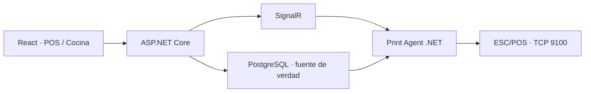

# DiwyPOS

### Punto de venta multi-tenant con inventario, cocina y operación en tiempo real

[](https://dotnet.microsoft.com/) [](https://react.dev/) [](./docs/architecture.md) [](#alcance-público)

DiwyPOS coordina mesas, pedidos, cocina, pagos, inventario y reportes para restaurantes. Incluye una cola persistente de comandas y un agente local que habla ESC/POS con impresoras de red.

> Este repositorio contiene arquitectura, contratos y una muestra segura. El código productivo y la configuración de cada negocio permanecen privados.

## Problema

Un POS no puede perder una comanda por una desconexión ni mezclar datos entre negocios. También debe conservar costos históricos aunque cambie el precio de un ingrediente. DiwyPOS trata persistencia, aislamiento tenant y operación degradada como requisitos centrales.

## Mi responsabilidad

Desarrollo full-stack: API .NET, EF Core, JWT/roles, multi-tenancy, SignalR, modelado de pedidos e inventario, agente de impresión y frontend React responsive.

## Capacidades demostradas

- ASP.NET Core .NET 10 y PostgreSQL.
- JWT con claims de tenant y rol.
- Pedidos, pagos, mesas, inventario y dashboard.
- Unidades normalizadas para masa, volumen y conteo.
- Snapshot de costo por item para utilidad histórica.
- Cola persistente + SignalR + polling como garantía.
- Agente Linux/Windows autocontenido y transporte ESC/POS TCP.
- 11 clases de pruebas entre API y agente de impresión.

## Arquitectura



Detalles: [arquitectura](./docs/architecture.md), [decisiones](./docs/decisions.md), [roadmap](./docs/roadmap.md).

## Muestra pública

`MeasurementUnitConverter` normaliza cantidades y costos con tipos decimales, validación estricta y conversiones explícitas.

```bash
dotnet test tests/DiwyPOS.PublicSample.Tests.csproj
```

Consulta [código](./sample-code/MeasurementUnitConverter.cs), [pruebas](./tests/MeasurementUnitConverterTests.cs) y [OpenAPI](./api/openapi.yaml).

## Demo

La instancia del restaurante no es pública. La demo prevista usará un tenant aislado, menú sintético y ninguna impresora real.

## Resultados verificables

- Los trabajos de impresión sobreviven a la desconexión del agente.
- Adiciones y reimpresiones son eventos explícitos y auditables.
- Costos se congelan por item y cantidades se guardan en unidad base.
- La suite privada cubre auth, pedidos, pagos, mesas, inventario, finanzas, impresión y formato ESC/POS.

## Alcance público

| Público | Privado |
| --- | --- |
| Diseño de cola y agente | Direcciones de impresoras y credenciales |
| Conversor de unidades y tests | Código productivo y datos de ventas |
| OpenAPI reducido | Configuración tenant completa |

Seguridad: [SECURITY.md](./SECURITY.md).
