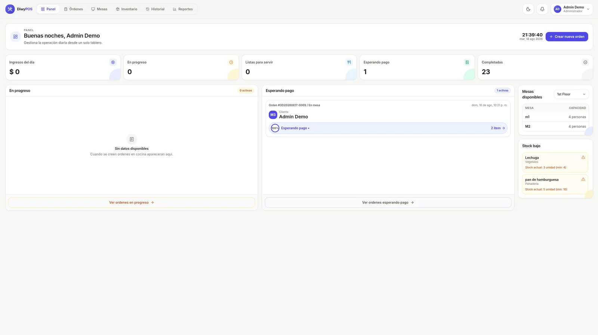
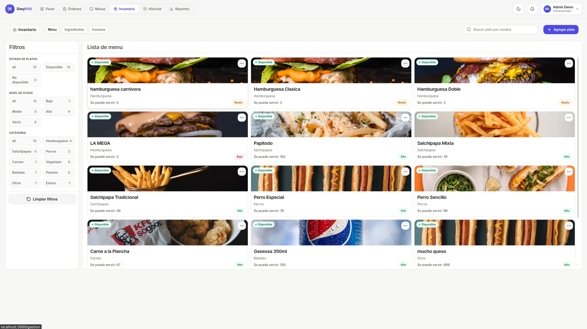
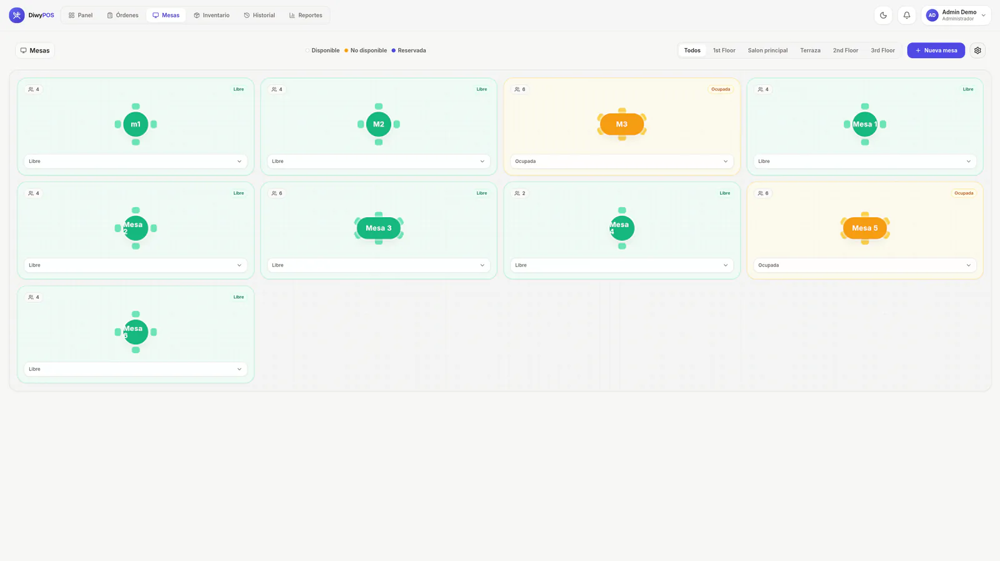
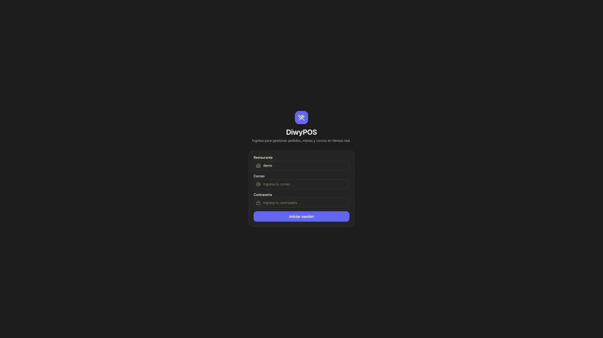

# DiwyPOS product tour

These captures use a synthetic restaurant tenant and demo operator. Theme-aware views switch automatically between light and dark variants. Open the [live demo](https://diwy-pos-web.vercel.app/) to explore the current interface.

## Operations dashboard

The main workspace prioritizes orders in progress, payment state, table availability, and low-stock warnings for fast operational scanning.

<picture>
  <source media="(prefers-color-scheme: dark)" srcset="../screenshots/diwypos-dashboard-dark-900.webp 900w, ../screenshots/diwypos-dashboard-dark-1600.webp 1600w">
  <source media="(prefers-color-scheme: light)" srcset="../screenshots/diwypos-dashboard-900.webp 900w, ../screenshots/diwypos-dashboard-1600.webp 1600w">
  
</picture>

## Inventory and menu availability

Menu availability is derived from ingredient stock, while operational filters surface items that require action.

<picture>
  <source media="(prefers-color-scheme: dark)" srcset="../screenshots/diwypos-inventory-dark-900.webp 900w, ../screenshots/diwypos-inventory-dark-1600.webp 1600w">
  <source media="(prefers-color-scheme: light)" srcset="../screenshots/diwypos-inventory-900.webp 900w, ../screenshots/diwypos-inventory-1600.webp 1600w">
  
</picture>

## Table management

The floor view communicates capacity and occupancy at a glance while preserving explicit status controls.

<picture>
  <source media="(prefers-color-scheme: dark)" srcset="../screenshots/diwypos-tables-dark-900.webp 900w, ../screenshots/diwypos-tables-dark-1600.webp 1600w">
  <source media="(prefers-color-scheme: light)" srcset="../screenshots/diwypos-tables-900.webp 900w, ../screenshots/diwypos-tables-1600.webp 1600w">
  
</picture>

## Tenant-aware authentication

The sign-in flow establishes restaurant, identity, and role context before any operational data is requested.

<picture>
  <source media="(max-width: 900px)" srcset="../screenshots/diwypos-login-dark-900.webp">
  
</picture>

Return to the [case study](../README.md) or review the [architecture](./architecture.md).
